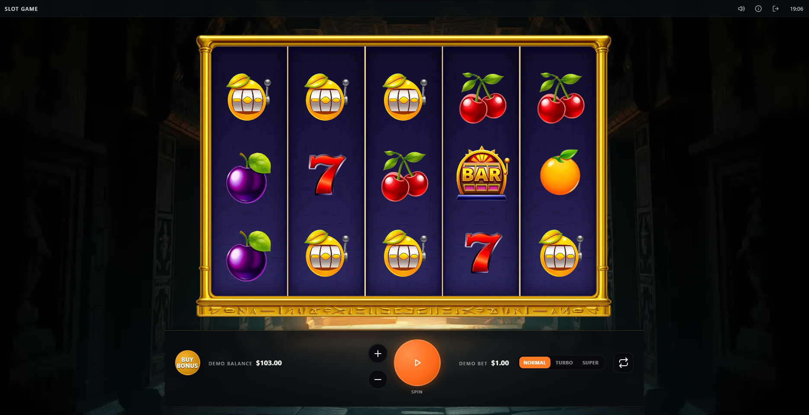

# Slot Game



A fully-featured browser-based slot game built from the ground up as a personal portfolio project. The game is currently **under active development** and will be publicly hosted in the future so anyone can play it directly in their browser — no download required.

> **Status:** Feature-complete — ongoing polish, payline tuning, and codebase maintenance.

---

## Repository Branches

| Branch | Purpose | Network layer |
|--------|---------|---------------|
| `main` | Production / live deployment (Vercel) | Built-in mock server — no backend required |
| `backend` | Active development — real Python engine | FastAPI backend at `http://localhost:8000` |

**You are on the `backend` branch.**
This branch connects the game to a real, mathematically correct Python game engine instead of the built-in mock server. The Python backend repository will be made public in a future release.

> To switch to the live deployment version, check out `main`.

---

## About the Project

This is a client-side slot game engine built with modern web technologies. It demonstrates production-grade architecture patterns used in real iGaming products, including a fully reactive UI, a finite-state-machine-driven game loop, a scriptable mock network layer for testing, and adaptive layout across every screen size from mobile portrait to 4K desktop.

The project is intentionally built to the standard of a commercial iGaming client — not a tutorial or prototype.

### Key Technical Highlights

- **Pixi.js v8** rendering engine for smooth 60fps reel animations with GSAP-powered easing
- **Preact + MobX** reactive HUD overlay — components re-render only when relevant store values change
- **Finite State Machine** game loop — each phase (spin, win-show) is an isolated, testable unit
- **Adaptive layout engine** — `SmartContainer` auto-positions every scene element across portrait/landscape and all viewport sizes using per-orientation fit/align configs
- **Web Audio engine** — `SoundManager` routes SFX and music through independent gain nodes (master mute, per-category volume). All timing is scheduled through the FSM ticker so sounds stay frame-accurate. Autoplay policy is handled with a lazy `AudioContext` that resumes on first user interaction
- **Three-tier test suite** — unit tests (Vitest), end-to-end behavior scenarios (Playwright), and a 16-viewport screenshot matrix
- **In-page test bridge** — exposes the full game state to Playwright specs; lets tests script server responses, simulate connection loss, click canvas buttons by semantic label, and record zero-code spec files live
- **Realistic mock network** — weighted reel strips (Fisher-Yates shuffled per session), 20-payline evaluation with left-to-right wild substitution, scatter pays anywhere, and variable latency; no real backend required
- **Responsive bet board** — CSS `zoom`-scaled unified control panel that never clips or overlaps at any viewport width
- **Speed pill** — single cycling button that steps through Normal → Turbo → Super spin speed modes
- **Paytable icons** — symbol images resolved from the AssetPack manifest at runtime so hashed filenames never break the UI
- **Swappable background system** — `TilingSprite`-based theming, live-swappable at runtime, no distortion at any aspect ratio

### Tech Stack

| Layer | Technology |
|---|---|
| Rendering | Pixi.js v8, GSAP |
| UI / HUD | Preact, MobX |
| Build | Vite 7, TypeScript 5, pnpm 9 |
| Testing | Vitest, Playwright |
| Linting | Biome |
| Asset pipeline | AssetPack (WebP/PNG, cache-busting) |

---

## Prerequisites

- **Node.js** 18 or later
- **pnpm** 9 — install with `npm i -g pnpm@9`

---

## Getting Started

This branch requires the Python backend to be running before starting the frontend.

**Step 1 — Start the Python backend**

```powershell
cd slot-backend
python -m venv .venv
Set-ExecutionPolicy -Scope Process -ExecutionPolicy RemoteSigned
.venv\Scripts\Activate.ps1
pip install -r requirements.txt
uvicorn main:app --reload --port 8000
```

**Step 2 — Start the frontend**

```bash
# Install dependencies (first time only)
pnpm install

# Start the dev server — talks to the Python backend at localhost:8000
pnpm dev                  # http://localhost:5173

# Build for production
pnpm build

# Preview the production build locally
pnpm preview
```

Other useful commands:

```bash
pnpm typecheck            # TypeScript type check (no emit)
pnpm lint                 # Biome linter
pnpm test                 # Unit + flow tests (Vitest)
pnpm test:e2e             # End-to-end behavior scenarios (Playwright)
pnpm test:screenshots     # 16-viewport screenshot matrix (Playwright)
```

> The network adapter is controlled by `.env.local` (not committed). On this branch it is set to `VITE_NETWORK=http` pointing at `http://localhost:8000/api`.

---

## Project Structure

```
src/
  composition.ts        Wiring root — the only file that knows how subsystems connect.
  state/                MobX stores: Balance, UI, Data.
  flow/                 FSM + phase handlers. Owns all game timing.
  presenters/           State → view adapters (reels, background).
  view/                 Pixi scenes, symbol classes, smart positioning.
  ui/                   Preact HUD — slots (header, menu, modals), shared components, hooks, styles.
  infrastructure/       Network, ticker, asset loader, analytics, SoundManager.
  config/               Grid config, symbol IDs, theme catalogue.
  testing/              Test bridge, inspector overlay, mock network.
tests/
  flow/                 Canvas-free FSM + store unit tests.
  scenarios/            Full Playwright behavior suite.
  screenshots/          Viewport projection matrix.
raw-assets/             Source art. Compile with `pnpm run assets:pack`.
```

---

## Architecture Notes

**Server is authoritative.** The client never evaluates spin outcomes — it only renders what the server returns. This mirrors the architecture of regulated iGaming products.

**No `setTimeout`.** All time is owned by the FSM and routed through `Ticker.schedule` so tests can freeze, step, and replay time deterministically.

**Win cell deduplication.** When multiple paylines share a cell (common with wilds), `ReelsPresenter` deduplicates positions before passing them to the spotlight engine, preventing stacked GSAP tweens that would otherwise leave symbols frozen.

**Disposable pattern.** Every Pixi object and MobX reaction implements `Disposable` and is cleaned up on scene teardown — no memory leaks across game sessions.

**HUD is DOM, not canvas.** The control panel (spin, bet, balance, autoplay) is a Preact overlay mounted above the Pixi canvas. This gives full CSS layout control, accessibility, and screen-reader support without sacrificing rendering performance.

---

## Roadmap

- [x] Sound engine integration
- [x] Final art and symbol set
- [x] Live hosting (public playable build)
- [x] Mobile touch gesture support
- [x] Payline geometry validation (±1-row adjacency constraint)
- [x] Dead code removal (legacy rules overlay, unused Pixi HUD layer)


---

## Testing

Three independent test suites cover different layers of the application:

| Suite | Tool | What it covers |
|---|---|---|
| `pnpm test` | Vitest | FSM phases, store logic, network contract |
| `pnpm test:e2e` | Playwright | Full behavior — spins, bets, autoplay, network failure recovery |
| `pnpm test:screenshots` | Playwright | Visual pixel diffs across 16 viewport sizes |

The end-to-end suite uses an **in-page test bridge** that scripts server responses deterministically, simulates connection loss, and drives the HUD without relying on pixel coordinates. No real backend is needed.

---

## License

This project is published for **viewing and study purposes only**.

- You may read, run locally, and learn from the code.
- You may **not** copy, redistribute, sublicense, or use any part of it in a commercial product.
- You may **not** publish derivative works without written permission.

See the [LICENSE](LICENSE) file for the full terms.

© 2026. All rights reserved.
